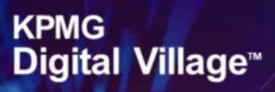

# Contract Comparison Tool

A modern, AI-powered web application for analyzing and comparing client and vendor contracts. Upload two PDF contracts, and the tool will extract, compare, and summarize key clauses, highlight risks, and provide actionable recommendations—all with a beautiful, interactive UI.

<!--

-->

---

## Features

- **PDF Upload:** Drag-and-drop or browse to upload client and vendor contracts (PDF).
- **Clause Extraction:** Automatically identifies and extracts key clauses (Termination, Delivery Terms, Payment Terms, Confidentiality and IP, Limitation of Liability).
- **AI-Powered Comparison:** Uses Mistral and OpenAI (GPT-4o) to compare clauses, summarize differences, assess risk, and suggest vendor recommendations.
- **Risk Summary:** Instantly see how many clauses are HIGH, MEDIUM, LOW, or UNKNOWN risk.
- **Detailed Results:** Each clause displays risk, summary, recommendation, and the original source text (collapsible).
- **Beautiful UI/UX:** Full-width, animated cards, color-coded risk badges, icons, and smooth transitions.
- **Model Switcher:** Toggle between Mistral and OpenAI for real-time comparison.
- **Branded Experience:** <!-- Includes KPMG Digital Village branding and a polished, client-ready interface. -->

---

## Getting Started

### Prerequisites

- Node.js 18+
- npm or pnpm

### Installation

```bash
cd contract-comparison-tool
npm install
# or
pnpm install
```

### Environment Variables

Create a `.env.local` file in the root with your API keys:

```
MISTRAL_API_URL=your_mistral_api_url
MISTRAL_API_KEY=your_mistral_api_key
OPENAI_API_KEY=your_openai_api_key
```

### Running the App

```bash
npm run dev
# or
pnpm dev
```

Visit [http://localhost:3000](http://localhost:3000) in your browser.

---

## Project Structure

```
contract-comparison-tool/
├── app/
│   ├── api/
│   │   └── upload/route.ts      # Main API route for contract comparison
│   ├── globals.css              # Global styles (Tailwind)
│   ├── layout.tsx, page.tsx     # App entry points
├── components/
│   ├── ComparisonResults.tsx    # Main results UI component
│   └── ui/                      # Reusable UI components
├── lib/
│   ├── ai-mistral.ts            # Mistral AI integration
│   ├── ai-openai.ts             # OpenAI integration
│   ├── pdf-parser.ts            # PDF parsing and clause extraction
│   └── ai-service.ts            # Additional AI utilities
├── public/
│   ├── kpmg-digital-village.png # Branding/logo
│   ├── mistral-logo.png, openai-logo.png
├── contract-comparison-tool.tsx # Main React page/component
├── package.json, tsconfig.json, tailwind.config.ts, etc.
```

---

## Key Technologies

- **Next.js 13+ (App Router)**
- **React 18+**
- **Tailwind CSS**
- **OpenAI & Mistral API**
- **pdf-parse** for PDF text extraction

---

## Customization

- **Branding:** Replace `public/kpmg-digital-village.png` and update the header for your organization.
- **Key Clauses:** Edit `KEY_CLAUSE_TYPES` in `contract-comparison-tool.tsx` and backend logic to focus on different clauses.
- **AI Models:** Add or swap out AI providers in `lib/ai-mistral.ts` and `lib/ai-openai.ts`.

---

## License

This project is for demonstration and internal use. For commercial or client deployment, please review all dependencies and ensure compliance with your organization's policies.

---

## Acknowledgements

<!--
- KPMG Digital Village for branding and design guidance.
-->
- OpenAI and Mistral for AI-powered contract analysis.

---

Feel free to further customize this README for your team or client! 